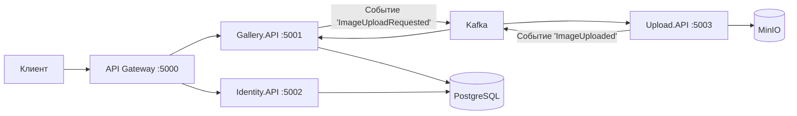

# Art Gallery Microservices

Микросервисная платформа для размещения и продажи произведений искусства. Pet-проект для изучения современных технологий: .NET 8, Kafka, Docker, микросервисная архитектура.

## 🎯 Архитектура проекта

Проект построен как набор слабосвязанных микросервисов, взаимодействующих через асинхронные сообщения (Kafka) и синхронные HTTP-запросы через API Gateway.

### 🧩 Компоненты системы

| Компонент | Описание | Порт |
| :--- | :--- | :--- |
| **API Gateway** | Единая точка входа на основе YARP, маршрутизация и JWT-валидация | 5000 |
| **Identity.API** | Сервис аутентификации и авторизации (регистрация, вход, JWT) | 5002 |
| **Gallery.API** | Управление картинами (CRUD, метаданные) | 5001 |
| **Upload.API** | *(в разработке)* Асинхронная загрузка файлов через Kafka | 5003 |
| **PostgreSQL** | Реляционная БД (каждый сервис имеет свою схему) | 5432 |
| **Kafka** | Брокер сообщений для асинхронной коммуникации | 9092 |
| **Redis** | Кеширование и сессии | 6379 |
| **MinIO** | S3-совместимое хранилище для картин | 9000, 9001 |

### 📊 Схема взаимодействия



🛠️ Стек технологий

| Компонент | Технология |
| :--- | :--- |
| Backend | C#, .NET 8, ASP.NET Core |
| API Gateway | YARP (Yet Another Reverse Proxy) |
| Брокер сообщений | Apache Kafka |
| База данных | PostgreSQL (каждый сервис имеет свою схему) |
| Кеш | Redis |
| Хранилище файлов | MinIO (S3-совместимое) |
| Контейнеризация | Docker, Docker Compose |
| Аутентификация | JWT (HS256) |
| CI/CD | GitHub Actions |

🚀 Быстрый старт

1. Клонируйте репозиторий

```bash
git clone https://github.com/alexey110af35-pixel/art-gallery-microservices.git
cd art-gallery-microservices
```

2. Поднимите инфраструктуру

```bash
docker-compose up -d
```

3. Настройте переменные окружения

Создайте файл `.env` в корне проекта и добавьте:

```env
JWT__SECRET_KEY=Ваш_Супер_Секретный_Ключ_Длиной_Не_Менее_32_Символов
JWT__ISSUER=ArtGallery
JWT__AUDIENCE=ArtGalleryUsers
```

4. Примените миграции

```bash
cd src/Services/Gallery/Gallery.API
dotnet ef database update

cd ../Identity/Identity.API
dotnet ef database update
```

5. Запустите сервисы

Откройте три терминала и выполните:

Терминал 1 (Gateway):

```bash
cd src/ApiGateway
dotnet run --urls="http://localhost:5000"
```

Терминал 2 (Identity.API):

```bash
cd src/Services/Identity/Identity.API
dotnet run --urls="http://localhost:5002"
```

Терминал 3 (Gallery.API):

```bash
cd src/Services/Gallery/Gallery.API
dotnet run --urls="http://localhost:5001"
```

6. Проверьте работу

Зарегистрируйте пользователя через Swagger: http://localhost:5002/swagger

Войдите и скопируйте JWT-токен.

Создайте картину через Gateway: POST http://localhost:5000/gallery/paintings с заголовком Authorization: Bearer <токен>

🎯 План развития

Этап 1: Docker Compose (инфраструктура)

Этап 2: API Gateway + Gallery Service (CRUD)

Этап 3: Аутентификация (Identity Service + JWT)

Этап 4: Асинхронная обработка через Kafka (Upload Service)

Этап 5: Frontend (React)

Этап 6: CI/CD (GitHub Actions)

Этап 7: Мониторинг (Prometheus + Grafana)

Этап 8: Деплой на Kubernetes

📄 Лицензия

MIT
